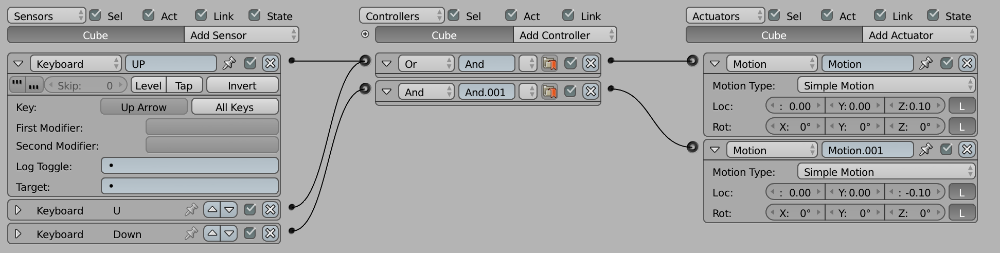
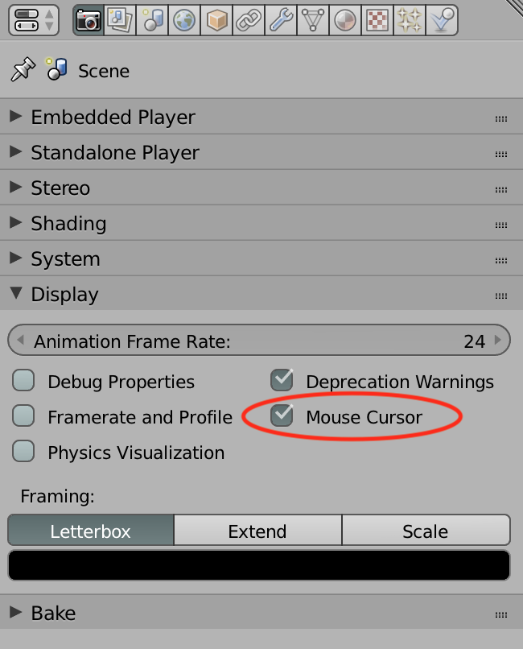
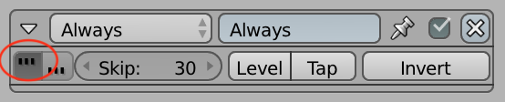
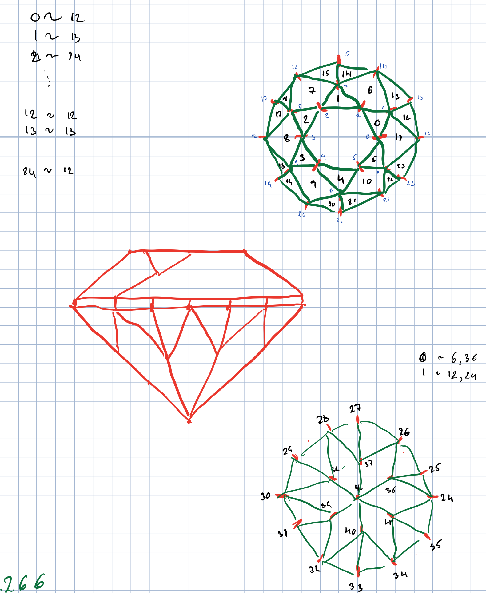

# Interactivity (in blender)

## Learning goal
After this lecture I want you to be able to:

* Apply the concepts of sensor and actuators to blender logic blocks
* Be able to use the keyboard and mouse to activate python code in blender
* Be able to read keyboard and mouse from within blender python
* Be able to connect actuators to sensors

## Connecting the real worl and the digital
To respond to the world around us, you must have some way of sensing the world. Humans have sensors for light (eyes), sound (ears), collision (touch), and chemical analysis (smell and taste). Some animals have senses for magnetic force, and some can sense in other ranges than us (some can sense ultra-violet, infra-red, or hear very high or low frequency sounds).

For the computer to be able to do interesting stuff, it too need to be connected to sensors. The typical sensors include a keyboard so it will "hear" what keys we are pressing, and a mouse or touch pad to let it sense preasure and movement.

A human is able to **act** in the world - through speach and physical manipulation. The computer primarily acts by manipulating the light on the screen and by emitting sounds. 

From these very general ideas comes the notion of **sensors** and **actuators**.

As is typical for computer programming, we can deal with concepts at many different levels of abstraction.

### Keyboards
An obvious observation is that a keyboard has a number of keys, most marked with one of more characters. At the lowest level of abstraction, a keyboard is a sensor which is able to tell which keys are currently pressed down (and which is not).

Programming by reading the keyboard is not really practical, so a keyboard driver is normally between the hardware keyboard and the application program. That keyboard driver takes care of things like:

* Only generating one key-press at a time
* Handling "modifier keys" (Shift, control, alt etc.)
* Handling different languages - the ";" is not the same key in all languages.
* and so on

### Mouse, joystic
Just like with the keyboard, the computer has drivers for letting application programs (like blender) work at a more reasonable level than pure button presses.

### What - is this a sensor too?
If you look at in blender, you will see it has some perhaps surprising sensors like: collision, delay, random and radar. That is because

* the imporant concept is that you program respond to stimuli generated from outside your program. Such stimuli is trough the **sensors** of your program.
	* In other situations, sensors are called *events*

In blender, the sensors are tied to a specific object. Each object has its own set of sensors.

### Actuators
The other aspect of the story is that only action counts. If you or your program do not do anything, it is rather boring. For a program to do something, it need to give feedback into the world.

In blender, you can give feedback in the form of:

* Changing what happens on the screen
* Making sounds

# Logic blocks
So we want our program to react to input from the sensors, and respond using actuators.

Before we do that however, I am going to assume you read this intro to "[The game loop](BGEGuide-to-the-GameLoop.pdf)", which I have stolen from a blender artist named "Monster" (https://blenderartists.org/t/monsters-resources/493045).

Notice - in the Scene properties you can change the FPS settings. Sometimes it can be useful to set it to 1 frame per second to see what is actually taking place.

## Keyboard sensor
##### Example 1
The first example is named "[UpDown](blend/UpDown.blend)", and is a simple box which can be moved up or down using the keyboard. The logic is specified as:



I have made it so that the cube can be move up on either "up arrow" or "u". Try to change it so that you have to press both up and U.

## Motion actuator
The motion actuator can be used on both static objects, and on rigid/dynamic objects. The options for what you can do differs for the different types of objects.

#### Moving static objects
The UpDown example uses 'Simple Motion'. At each tick of the game-loop, it moves the cube by 0.1 units - if your want your static objects to interact with physical objects you must take care not to move them too far in each step.

#### Moving physical objects
When you mark an object as rigid body it you get more options in the movement. In particular you get the option to move the object by applying a force onto it. 
The difference in applying a force and changing the location directly (as with static objects) is that it is the physics engine which compute the coordinates for the object in the next frame.

##### Example 2
The example "[PhysMove](blend/PhysMove.blend)" applies a force on the y-axis. Next to the force settings is an "L". Try to figure out what it does by hitting the obstacle with the "L" checked and not checked.

As usually with blender - there are many other settings to play around with. I stop here for the keyboard sensor and simple motions.

## Mouse sensor
The mouse sensor works pretty straight forward, and can respond to clicks on the buttons of the mouse.

However, there is one setting which can be useful in some game plays, "mouse over", as it will respond to the mouse being over a specfic object in the scene. Combined with a keyboard input, it can be used to activate if you press "i" (for investigate) over a specific object.

##### Example 3
The example "[MouseOver](blend/MouseOver.blend)" shows how the cube moves along the Y axis if you move your mouse over it. Notice, you need to have the Mouse Cursor enabled in the scene for this to make any sense.



## Sound activator
To add sound effects, you need to use a sound actuator. It has different settings, and I believe [the manual actually describe them fairly well](https://docs.blender.org/manual/en/latest/game_engine/logic/actuators/types/sound.html).

##### Example 4
The example "[Sound](blend/Sound.blend)" plays the boing sound when you move the cursor over the cube. Notice, the play mode of the actuator is set to "Play End", which will play the sound to the end, and ignore other signals to start playing while it is still finishing its first sound.

## Colision sensor
The collision sensor activates if the bounding box of object it is attached to is hits the bounding box of some other object. 

##### Example 5
In the example "[Boings](blend/Boings.blend)" a boing sound will be played each time one of the blue balls hits something.

## Delay, always and Edit object
The "[BallMill](blend/BallMill.blend)" uses a few other sensors and actuators. The main build is a mill wheel which is hinged on a stand. There is a feeder box that collects the balls, and the gravity and mass of the balls force the wheel to turn.

Besides the build, it is necessary to produce new balls at a steady rate, and in order for the balls not to fill up the universe, they die after a while. Lets see how this is done.

##### Making new balls
The actuator "Edit object" has several settings, here I use the "Add object". The ball will be added at the location of the owner of the actuator - in this case it is an "Empty". The object to be added must exist already in the scene. I have hidden it in the second layer. It does not matter where it is, it is used as a template and a new copy is made each time the actuator fires

##### Making many new balls
The new ball actuator is tied to an "Always sensor". That sensor simply fires at each frame. Except in our case it has a "skip of 30 frames". At 60 FPS, that is two new balls every five second. 

Notice the "[True level triggering](https://docs.blender.org/manual/en/latest/game_engine/logic/sensors/introduction.html#game-engine-logic-sensors-common-options)":



If you do not mark this one, the "Always" is actually run only once at the beginning of the game.

##### Making the balls die
If you select the ball in the other layer, you can see it has a delay sensor. It delays for 300 frames (5 seconds at 60 FPS), then fires. The actuator is again a "Edit object" actuator, this time with "End object" as the action.

## Combining logic bricks into a small game
As you know, I have drawn some of my examples from [the car game tutorial](http://blender.freemovies.co.uk/car-game-tutorials/).

There is a [section on getting the camera to work](https://www.youtube.com/watch?v=kJNnFw0Qlic) as shown in class. 

I could not resist, and made a gemstone mesh (see the the file `gemstone.py`). I cannot just do such thing in my head, and had to draw something to help me.



Honestly, it took me several tries until I finally wrote this little function:

```python
# computes an index based on a cyclus of N, and offset
def mod(a, N,offset):
    return (a % N) + offset
```

In my experience, you always need to be careful getting your modulus right so you can "count in cycles".

The function is used extensively to produce the gemstone mesh.

#### Lack of material
Notice, the `gemstone.py`does not produce material for the gemstone. Different materials are needed for different gemstones.
